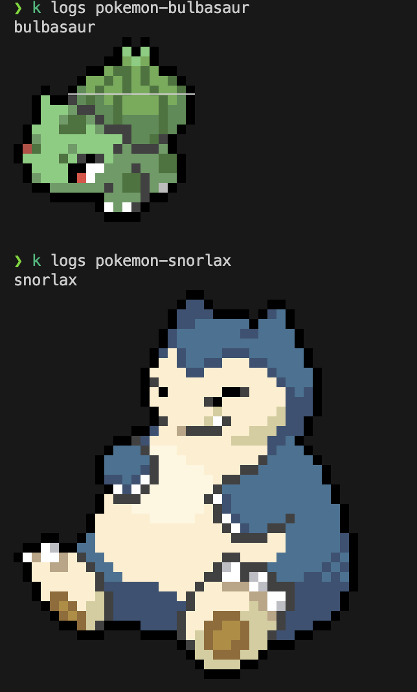

# POC CRD

## Requirements

- [ ] Create a very simple CRD. 
- [ ] Creating an instance of the CRD should create a pod and delete it when the instance is deleted.

## Setting the Custom Resource Definition

```bash
❯ kubectl apply -f pkm-crd.yaml
customresourcedefinition.apiextensions.k8s.io/pokemons.datacenter.com created

❯ kubectl get crd
NAME                      CREATED AT
pokemons.datacenter.com   2023-09-30T14:08:12Z

❯ kubectl get pokemon
No resources found in default namespace.
```

## Running the controller

```bash
❯ python pkm-controller.py
Watching for Pokemon CR changes...
Pokemon bulbasaur created. Creating a pod...
Pokemon snorlax created. Creating a pod...
```

## Create pkm instances

```bash
❯ kubectl apply -f pkm-instance.yaml
pokemon.datacenter.com/bulbasaur created

❯ kubectl get pkm
NAME        AGE
bulbasaur   71s

❯ kubectl apply -f pkm-instance.yaml
pokemon.datacenter.com/snorlax created

❯ kubectl get pkm
NAME        AGE
bulbasaur   3m11s
snorlax     16s
```

## Checking the pods
```bash
❯ kubectl get po
NAME                READY   STATUS             RESTARTS      AGE
pokemon-bulbasaur   0/1     CrashLoopBackOff   5 (51s ago)   3m44s
pokemon-snorlax     0/1     Completed          3 (33s ago)   49s
```



## Deleting the pkm instances

```bash
❯ kubectl delete pkm snorlax
pokemon.datacenter.com "snorlax" deleted
❯ kubectl delete pkm bulbasaur
pokemon.datacenter.com "bulbasaur" deleted

...Watching for Pokemon CR changes...
Pokemon bulbasaur created. Creating a pod...
Pokemon snorlax created. Creating a pod...
Pokemon snorlax deleted. Deleting its pod...
Pokemon bulbasaur deleted. Deleting its pod...

❯ kubectl get pkm
No resources found in default namespace.

❯ kubectl get pods
No resources found in default namespace.
```
